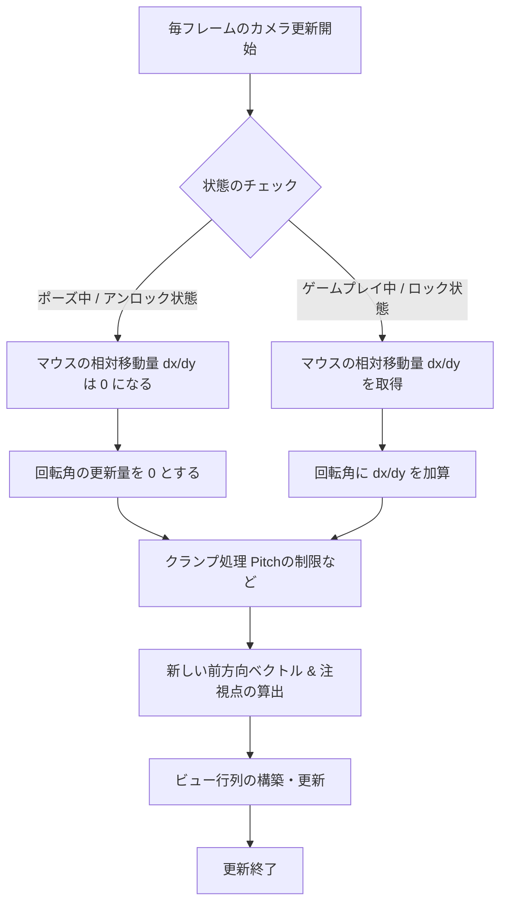

# マウスとカメラの理想的な実装フロー

3Dゲーム（特にFPSやTPSカメラ操作を行うゲーム）における、マウス制御とカメラ動作の理想的な設計および実装フローについて解説します。

---

## 1. 理想的な設計思想：絶対座標と相対座標の明確な分離

マウスの入力データは、使用目的によって求められる性質が根本的に異なります。

| 用途 | 必要なデータ | 望ましい挙動 |
| :--- | :--- | :--- |
| **UI操作（ボタンホバー・クリックなど）** | **絶対座標** (ウィンドウ内のピクセル位置) | OSやウィンドウシステムと連動し、カーソルが画面内を自由に動く。 |
| **カメラ操作（視点回転など）** | **相対移動量** (前フレームからの変化量・デルタ) | マウスカーソルが画面端で止まらずに無限に回転し続けるため、カーソル自体は画面中央にロック・非表示にする。 |

これらを単一の `x`/`y` 変数で使い回そうとすると、モード変更（ポーズ画面の開閉など）の際に入力の誤認や蓄積が発生し、カメラが吹き飛ぶ・高速回転する・UIが動かなくなるといった不具合の原因になります。
そのため、データ構造（`Mouse_State`）のレベルで、**絶対座標 (`x`/`y`)** と **相対移動量 (`dx`/`dy`)** を完全に独立させて定義することが理想です。

---

## 2. 理想的なマウスモジュールの実装フロー

マウスモジュール（`mouse.cpp` 等）は、以下のライフサイクルと状態管理を行います。

### ① 初期化（Initialize）
- アプリケーション起動時、生入力（Raw Input）を登録してデバイスからの直接的な入力量を監視します。
- 初期モードは通常 **絶対座標モード（ABSOLUTE）** とします。

### ② モード遷移制御（SetMode）
- **相対座標モード（RELATIVE / ロック時）**:
  - マウスカーソルを非表示にする (`ShowCursor(FALSE)`)。
  - カーソルをウィンドウ矩形内に閉じ込める (`ClipCursor()`)。
  - 毎フレーム、ウィンドウ中央にカーソルを引き戻す（またはRaw Inputを処理する）。
- **絶対座標モード（ABSOLUTE / アンロック時）**:
  - カーソルを制限解除する (`ClipCursor(nullptr)`)。
  - マウスカーソルを表示する (`ShowCursor(TRUE)`)。
  - 相対移動量 (`dx`/`dy`) を強制的に `0` にリセットする。

### ③ 毎フレームの更新（Update / ProcessMessage）
- **絶対座標モード時**:
  - `WM_MOUSEMOVE` 等から取得した座標を `x`, `y` に代入し、`dx`, `dy` は常に `0` にします。
- **相対座標モード時**:
  - `WM_INPUT` (Raw Input) から取得したデルタ値を `dx`, `dy` に蓄積します。`x`, `y` は `0` または無効値にします。
  - `dx`, `dy` はゲームループ側で1回「読み取られ」たら、次のフレームの入力があるまで `0` にリセットされます（リセット用イベントやフラグの制御）。

---

## 3. 理想的なカメラ制御の実装フロー

カメラ（`camera.cpp`, `debugcamera.cpp` 等）は、マウスの状態を受け取って次のように動作します。

### ① 更新処理（Update）
1. **マウス状態の取得**:
   `Mouse_GetState(&state)` で最新の状態を受け取ります。
2. **回転量の計算**:
   - `state.dx` および `state.dy` の値に感度（Sensitivity）を乗算し、Yaw (水平回転) と Pitch (垂直回転) に加算します。
   - **ポイント**: モード判定をカメラ側で行わなくても、マウスモジュール側で「アンロック時は `dx = dy = 0`」が保証されていれば、カメラ側は安全に加算処理を記述できます。
3. **限界値のクランプ**:
   - 首がちぎれるような不自然な挙動を防ぐため、Pitch（上下角）を一般的に `-89度 〜 89度` の範囲にクランプします。
4. **注視点 (At) およびビュー行列の更新**:
   - 更新された Yaw / Pitch から前方ベクトル（Forward Vector）を算出し、カメラ位置（Pos）に足して注視点（At）を求め、ビュー行列を構築します。

---

## 4. ロック・アンロック（ポーズ切り替え）のシーケンス

ポーズ画面を挟むようなゲームプレイとメニューの往来では、以下の順序で制御を行うことで、入力の取りこぼしや一瞬のカメラの跳ね（チャタリング）を防ぐことができます。

### ゲームプレイからポーズ画面への遷移（アンロック時）
1. ゲームループを「ポーズ状態」に切り替える。
2. `UnLockMouse()` を呼び出す。
   - マウスカーソルを可視化。
   - マウスを絶対座標モードへ移行。
   - **`dx`, `dy` の相対移動量を `0` にリセットする（重要）**。
3. UI表示を開始し、UIシステムが `x`, `y` を使ってホバー等の衝突判定を行う。
   - この間, カメラ更新は動いていたとしても `dx = dy = 0` であるため、カメラは静止し続けます。

### ポーズ画面からゲームプレイへの復帰（ロック時）
1. ポーズ画面を閉じる。
2. `LockMouse()` を呼び出す。
   - マウスカーソルを非表示化。
   - マウスを相対座標モードへ移行。
   - **移行した最初のフレームは、前回の座標位置との差分等で大きなデルタ値が出やすいため、1〜2フレーム分の入力を強制的にスキップ（無視）するバッファ処理を入れるとより安定します（オプション）**。
3. カメラが `dx`, `dy` に基づいて再び視点移動を開始します。

---

## まとめ

今回のリファクタリングで適用した設計は、この理想的なフローに準拠しています。
- **データ構造の分離**: `Mouse_State` に `x`/`y` と `dx`/`dy` を分離定義したこと。
- **カプセル化**: マウスモジュール自身が「絶対座標モード中は相対移動量を `0` にする」責任を持つようにしたこと。
- **シンプルな呼び出し**: カメラ側は複雑な状態チェックを行わず、単純に `dx`/`dy` を加算するだけで安全に動くようになったこと。

この設計を維持することで、将来新しいカメラ（デバッグカメラ、カットシーンカメラ、イベントカメラなど）を追加した際にも、同様の不具合が再発するのを防ぐことができます。
